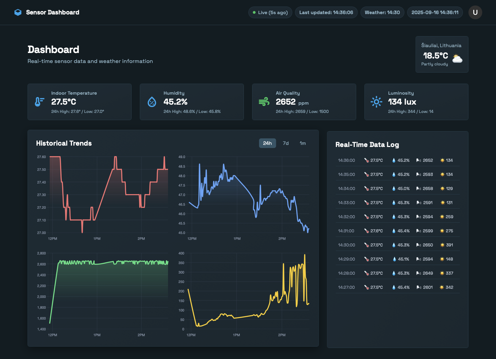

# Environmental Intelligence Hub

A modern, real-time IoT sensor data dashboard with WebSocket support, live weather integration, and comprehensive environmental monitoring capabilities.

## 📄 Preview

[](docs/Dashboard.pdf)

- **Dashboard PDF**: [Open full PDF](docs/Dashboard.pdf)

## 🌟 Features

### Real-time Data Monitoring
- **Live Sensor Data**: Temperature, humidity, air quality, and luminosity monitoring
- **WebSocket Integration**: Real-time updates without page refresh
- **Automatic Chart Updates**: Charts update instantly when new data arrives
- **Smart Data Log**: Shows latest 10 entries with fresh data on page load

### Interactive Dashboard
- **Modern UI**: Clean, responsive design with dark theme and glassy cards
- **Historical Trends**: 2×2 grid of charts (Temp, Humidity, AQ, Lux) with 24h/7d/30d ranges
- **Time-aware Axes**: Proper time-scale rendering via Chart.js time adapter for clean labels
- **Live Weather**: Real-time weather data for Šiauliai, Lithuania (updates every 15 minutes)
- **Status Indicators**: Connection status, last update times, and Lithuania timezone display

### Data Visualization
- **Interactive Charts**: Hover for exact timestamps/values; smooth updates
- **Time Adapter**: Chart.js + Moment adapter for time-based x-axis (no label gaps)
- **Responsive Design**: Works on desktop, tablet, and mobile
- **Real-time Metrics**: Live updating temperature, humidity, air quality, and luminosity cards

## 📊 API Endpoints

### Sensor Data
- `POST /api/data` - Receive sensor data from ESP32
- `GET /api/data` - Get all sensor readings
- `GET /api/data/latest` - Get the most recent reading
- `GET /api/data/initial` - Get comprehensive dashboard data
- `GET /api/data/history?range=24h|7d|30d` - Get historical data

### System Status
- `GET /api/status` - API health check
- `GET /api/health` - Detailed system status

### WebSocket Events
- `newData` - Real-time sensor data updates
- `historicalData` - Historical data responses
- `requestHistoricalData` - Client requests for specific time ranges

### API Configuration
The frontend automatically connects to the Azure production API:
- **Production API**: `https://sensor-api-c5arcwcxc7dsa7ce.polandcentral-01.azurewebsites.net`
- **Weather API**: Open-Meteo (automatic)
- **Timezone**: Europe/Vilnius (Lithuania)

## 📱 Dashboard Features

### Real-time Monitoring
- **Live Updates**: Data refreshes automatically via WebSocket
- **Connection Status**: Visual indicator for WebSocket/polling mode
- **Last Update Time**: Shows when data was last received
- **Lithuania Time**: Current time in Lithuania timezone

### Weather Integration
- **Location**: Šiauliai, Lithuania
- **Update Frequency**: Every 15 minutes (at 00, 15, 30, 45)
- **Timezone**: Lithuania timezone (EET/EEST)
- **Visual Feedback**: Weather widget flashes when updated

### Data Visualization
- **Interactive Charts**: Click and hover for detailed information
- **Data Points**: Visible points on chart lines for precise readings
- **Tooltips**: Show exact timestamps and values on hover
- **Time Ranges**: 24h, 7d, 30d views with proper timezone conversion

### Data Log
- **Latest 10 Entries**: Always shows the most recent sensor readings
- **Fresh Data**: Fetches from server on each page load
- **Real-time Updates**: New entries appear instantly
- **Timestamp Display**: All times in Lithuania timezone

## 🛠️ Technical Details

### Frontend Technologies
- **HTML5/CSS3**: Modern responsive design
- **JavaScript (ES6+)**: Vanilla JS with modern features
- **Chart.js**: Interactive charts with time adapter (Moment)
- **Socket.IO**: Real-time WebSocket communication
- **Tailwind CSS**: Utility-first CSS framework

### Backend Technologies
- **Node.js**: Server runtime
- **Express.js**: Web framework
- **Socket.IO**: Real-time communication
- **SQLite**: Lightweight database (production uses Azure)

### Database Schema
```sql
-- Sensor readings table
CREATE TABLE readings (
    id INTEGER PRIMARY KEY AUTOINCREMENT,
    temperature REAL NOT NULL,
    humidity REAL NOT NULL,
    airQuality REAL NOT NULL,
    luminosity REAL DEFAULT 0,
    timestamp DATETIME DEFAULT CURRENT_TIMESTAMP
);
```

## 🔄 Data Flow

1. **ESP32 Sensor** → Sends data to `/api/data` endpoint
2. **Server** → Stores data in database
3. **WebSocket** → Broadcasts to all connected clients
4. **Dashboard** → Updates charts, metrics, and data log in real-time

## 🌐 Production Deployment

### Azure Web App
- **URL**: https://sensor-api-c5arcwcxc7dsa7ce.polandcentral-01.azurewebsites.net
- **Region**: Poland Central
- **Database**: Azure SQL Database
